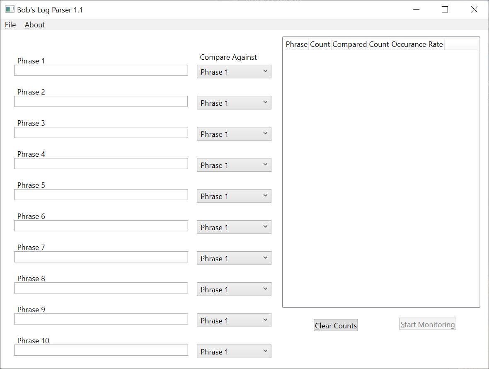

# Welcome to Bobs Parser

This is an ultralight little log parsing tool that is meant to watch a log file and then compare it to some key phrases.

# Usage Process
* Choose the Phrases you'll want to watch for
* Choose what phrase to compare that phrase against
* Click File -> Open -> Navigate to your Log file
* Click Start Monitoring Button

As your log file changes it will update totals and percentages

# Download

[Version 1.0 ](https://github.com/bobby5892/bobs-parser/blob/main/Bobs%20Parser/ReleaseBuild/1_0/Bobs%20Parser1_0.zip)

# Download Instructions
* Extract Zip
* Run Bob's Parser.exe
